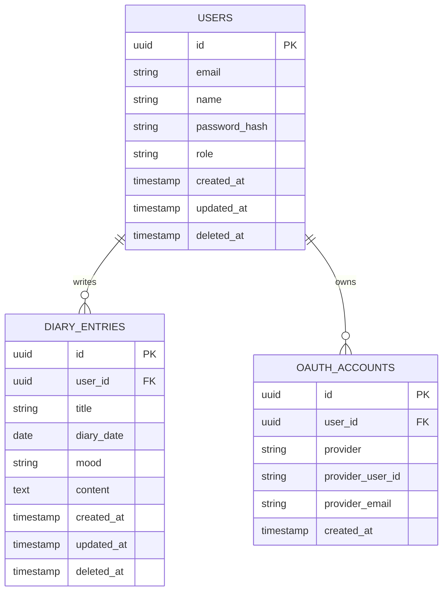

# Diary Project

> 하루의 감정과 기록을 남기고, 월간 달력과 차트로 작성 흐름을 확인하는 다이어리 서비스입니다.  
> 프론트엔드(Next.js)와 백엔드(SpringBoot)로 서버를 분리하고 실제 인증, 인가, DB 저장, 배포 환경까지 고려해 구현했습니다.

<br/>

## 목차

- [프로젝트 소개](#프로젝트-소개)
- [주요 기능](#주요-기능)
- [기술 스택](#기술-스택)
- [기술 선택 이유](#기술-선택-이유)
- [프로젝트 구조](#프로젝트-구조)
- [아키텍처](#아키텍처)
- [인증/인가 흐름](#인증인가-흐름)
- [데이터베이스 설계](#데이터베이스-설계)
- [API 명세](#api-명세)
- [환경변수](#환경변수)
- [로컬 실행 방법](#로컬-실행-방법)
- [배포](#배포)
- [검증 명령어](#검증-명령어)
- [구현하며 고려한 점](#구현하며-고려한-점)
- [향후 개선 사항](#향후-개선-사항)

<br/>

## 프로젝트 소개


[🌐링크](https://diary-project-beige.vercel.app/)
Diary Project는 사용자에게 글감을 주어 일기를 작성할 수 있도록 도와주는 서비스입니다.
사용자가 로그인 후 일기를 작성하면
작성한 기록을 월간 달력과 막대 그래프로 확인할 수 있습니다.

처음에는 프론트엔드에서 `localStorage` 기반으로 일기 데이터를 관리했지만, 실제 서비스 흐름에 가깝게 만들기 위해 Spring Boot API와 PostgreSQL DB 저장 방식으로 확장했습니다.

이 프로젝트에서 중점적으로 보여주고자 한 부분은 다음과 같습니다.

- Next.js 기반의 사용자 화면 구현
- Spring Boot 기반 REST API 설계
- JWT 기반 인증/인가 처리
- NextAuth와 백엔드 JWT 연동
- PostgreSQL/Supabase를 활용한 데이터 영속화
- Vercel, Render 배포를 고려한 환경변수 구성

<br/>

## 주요 기능

### 사용자 기능

- 일반 회원가입
- 일반 로그인
- Google 소셜 로그인 연동 구조
- 로그인 세션 유지

### 일기 기능

- 일기 작성
- 일기 목록 조회
- 월별 일기 조회
- 일기 수정
- 일기 삭제
- 작성 날짜 기준 월간 달력 표시
- 선택 월의 일별 작성 횟수 차트 표시
- 날짜 클릭 시 작성한 일기 상세 패널 표시

### 운영/배포 보조 기능

- Render 서버 health check API
- 10분 주기의 keep-alive 스케줄러
- 환경변수 기반 CORS, JWT, DB 설정

## 기술 스택

### Frontend

| 기술                 | 사용 목적                                |
| -------------------- | ---------------------------------------- |
| Next.js              | App Router 기반 프론트엔드 구현          |
| React                | 컴포넌트 기반 UI 구현                    |
| TypeScript           | 정적 타입 기반 안정성 확보               |
| styled-components    | 컴포넌트 단위 스타일 관리                |
| Ant Design           | Calendar, Modal 등 복잡한 UI 요소 활용   |
| Recharts             | 월별/일별 작성 횟수 차트 구현            |
| Recoil               | 클라이언트 전역 상태 관리                |
| NextAuth             | 프론트엔드 세션 및 소셜 로그인 흐름 관리 |
| React Hook Form, Zod | 회원가입 폼 검증                         |
| Framer Motion        | 홈 화면 텍스트 애니메이션                |

### Backend

| 기술            | 사용 목적                 |
| --------------- | ------------------------- |
| Java 21         | 백엔드 애플리케이션 구현  |
| Spring Boot     | REST API 서버 구현        |
| Spring Security | 인증/인가 필터 체인 구성  |
| JWT             | stateless 인증 처리       |
| Spring Data JPA | ORM 기반 DB 접근          |
| PostgreSQL      | 운영 데이터베이스         |
| Supabase        | 관리형 PostgreSQL 사용    |
| H2              | 테스트 환경용 인메모리 DB |
| Gradle          | 빌드 및 의존성 관리       |

### Deploy

| 플랫폼 | 사용 목적               |
| ------ | ----------------------- |
| Vercel | Next.js 프론트엔드 배포 |
| Render | Spring Boot 백엔드 배포 |

## 기술 선택 이유

### Next.js를 선택한 이유

프론트엔드는 API 라우트(API Routes) 기능을 적극적으로 활용하기 위해 Next.js를 선택했습니다.
Next.js의 API 라우트를 사용하면 백엔드 API를 직접 노출하지 않고 프론트엔드 서버를 거쳐 호출하는 프록시 역할을 수행할 수 있어, API 키나 민감한 정보를 안전하게 보호할 수 있기 때문입니다.
또한 별도의 백엔드 구성 없이도 간단한 사전 데이터 가공이나 NextAuth와의 유기적인 연동을 통한 세션 관리가 가능하며
Vercel 등을 통한 배포 편의성이 좋습니다.
클라이언트 요청 중개에 집중합니다.

### Spring Boot를 선택한 이유

백엔드는 인증, 인가, 데이터 검증, DB 접근처럼 서비스의 핵심 규칙을 책임져야 하므로 Spring Boot로 분리했습니다. 프론트엔드에서만 인증을 처리하면 API가 직접 호출될 때 보호되지 않기 때문에, 실제 권한 검증은 Spring Security와 JWT 기반으로 백엔드에서 처리하도록 설계했습니다.
또한 트래픽 분산과 서버확장성 그리고
Spring Boot는 트랜잭션 및 데이터검증의 표준화가 되어있다는 장점이 있어 다음과 같이 두 서버를 분리해놨습니다.

### NextAuth와 Spring Security를 함께 사용한 이유

NextAuth만 사용하면 프론트 세션 관리는 편하지만, 백엔드 API 자체를 보호하기 어렵습니다. 반대로 Spring Security만 사용하면 Google 로그인과 프론트 세션 처리를 직접 구현해야 하는 부담이 커집니다.

그래서 역할을 다음처럼 분리했습니다.

- NextAuth: 프론트엔드 세션 관리, Google 로그인 흐름 관리
- Spring Security: 백엔드 API 보호, JWT 검증, 사용자 권한 확인

즉, 권한의 기준은 백엔드에 두고, 프론트는 세션을 편하게 다루는 역할을 맡도록 구성했습니다.

### PostgreSQL/Supabase를 선택한 이유

일기 서비스는 사용자, 소셜 계정, 일기 데이터가 명확한 관계를 갖습니다. 따라서 관계형 데이터베이스가 적합하다고 판단했습니다.

Supabase는 관리형 PostgreSQL을 제공하기 때문에 직접 DB 서버를 운영하지 않아도 되고, 포트폴리오 프로젝트에서 실제 운영 DB 연결 경험을 보여주기에 적합합니다.

### styled-components를 선택한 이유

프로젝트 초반부터 재사용 가능한 공통 컴포넌트를 만들고 있었기 때문에, 컴포넌트와 스타일을 함께 관리할 수 있는 styled-components를 사용했습니다.

CSS 파일이 커지는 것을 피하고, 버튼, 카드, 레이아웃, 다이어리 화면 등 UI 단위를 명확하게 분리할 수 있다는 점을 고려했습니다.

### Ant Design과 Recharts를 선택한 이유

월간 기록 화면에는 달력과 차트가 필요했습니다.

달력은 날짜 선택, 월 이동, 셀 커스터마이징이 필요했기 때문에 Ant Design Calendar를 사용했습니다. 차트는 일별 작성 횟수를 빠르게 시각화하기 위해 Recharts를 선택했습니다.

두 라이브러리 모두 직접 구현하면 시간이 많이 드는 UI 복잡도를 줄여주며, 포트폴리오에서는 비즈니스 로직과 화면 완성도에 더 집중할 수 있게 해줍니다.

## 프로젝트 구조

```text
jh-diary-project
├─ frontend
│  ├─ app
│  │  ├─ api/auth
│  │  ├─ calendar
│  │  ├─ register
│  │  ├─ layout.tsx
│  │  └─ page.tsx
│  ├─ src
│  │  ├─ components
│  │  │  ├─ auth
│  │  │  ├─ common
│  │  │  ├─ diary
│  │  │  ├─ layout
│  │  │  └─ providers
│  │  ├─ data
│  │  ├─ lib
│  │  ├─ services
│  │  ├─ store
│  │  └─ types
│  └─ package.json
│
└─ backend
   ├─ src/main/java/com/example/diary
   │  ├─ controller
   │  ├─ dto
   │  ├─ entity
   │  ├─ exception
   │  ├─ repository
   │  ├─ scheduler
   │  ├─ security
   │  ├─ service
   │  └─ DiaryApplication.java
   ├─ src/main/resources
   └─ build.gradle
```

## 아키텍처

```text
Browser
  |
  | NextAuth Session
  v
Next.js Frontend
  |
  | Authorization: Bearer accessToken
  v
Spring Boot Backend
  |
  | Spring Security + JWT Filter
  v
Service Layer
  |
  | Spring Data JPA
  v
Supabase PostgreSQL
```

프론트엔드는 사용자 경험과 화면 상태를 담당하고, 백엔드는 인증/인가와 데이터 저장을 담당합니다.

## 인증/인가 흐름

### 일반 로그인

```text
1. 사용자가 이메일/비밀번호 입력
2. NextAuth CredentialsProvider가 백엔드 /api/auth/login 호출
3. Spring Boot가 이메일과 BCrypt 비밀번호 검증
4. 검증 성공 시 accessToken, refreshToken 발급
5. NextAuth 세션에 토큰 저장
6. 프론트 API 요청 시 Authorization 헤더에 accessToken 포함
7. Spring Security JWT 필터가 토큰 검증
8. SecurityContext에 인증 객체 저장
```

### Google 로그인

```text
1. NextAuth GoogleProvider로 Google 로그인
2. 로그인 성공 후 백엔드 /api/auth/social/google 호출
3. 백엔드가 users, oauth_accounts 조회 또는 생성
4. 백엔드 JWT 발급
5. NextAuth 세션에 백엔드 JWT 저장
```

### JWT 정책

| 토큰         | 기본 만료 시간 |
| ------------ | -------------- |
| accessToken  | 1시간          |
| refreshToken | 14일           |

현재 refreshToken 발급은 구현되어 있지만, 재발급 API는 향후 개선 항목으로 분리했습니다.

## 데이터베이스 설계



### 설계 의도

- `users`: 일반 회원과 소셜 회원을 같은 사용자 테이블에서 관리합니다.
- `oauth_accounts`: 소셜 로그인 정보를 별도 테이블로 분리해 여러 Provider 확장 가능성을 고려했습니다.
- `diary_entries`: 일기 본문, 날짜, 감정 정보를 저장합니다.
- `deleted_at`: 실제 삭제 대신 soft delete 흐름을 고려할 수 있도록 필드를 추가했습니다.

## API 명세

### Auth API

| Method | Endpoint                  | 설명               | 인증   |
| ------ | ------------------------- | ------------------ | ------ |
| POST   | `/api/auth/register`      | 회원가입           | 불필요 |
| POST   | `/api/auth/login`         | 일반 로그인        | 불필요 |
| POST   | `/api/auth/social/google` | Google 로그인 연동 | 불필요 |

### Diary API

| Method | Endpoint                     | 설명              | 인증 |
| ------ | ---------------------------- | ----------------- | ---- |
| GET    | `/api/diaries`               | 내 일기 전체 조회 | 필요 |
| GET    | `/api/diaries?month=YYYY-MM` | 내 월별 일기 조회 | 필요 |
| GET    | `/api/diaries/{id}`          | 내 일기 단건 조회 | 필요 |
| POST   | `/api/diaries`               | 일기 작성         | 필요 |
| PUT    | `/api/diaries/{id}`          | 일기 수정         | 필요 |
| DELETE | `/api/diaries/{id}`          | 일기 삭제         | 필요 |

### Health API

| Method | Endpoint      | 설명           | 인증   |
| ------ | ------------- | -------------- | ------ |
| GET    | `/api/health` | 서버 상태 확인 | 불필요 |

## 환경변수

실제 비밀값은 `.env.example`에 넣지 않고, 로컬 또는 배포 환경변수에만 설정합니다.

### Frontend

`frontend/.env.local`

```env
NEXTAUTH_URL=http://localhost:3000
NEXTAUTH_SECRET=replace-with-random-secret

BACKEND_API_URL=http://localhost:8080
NEXT_PUBLIC_API_BASE_URL=http://localhost:8080

GOOGLE_CLIENT_ID=
GOOGLE_CLIENT_SECRET=
```

### Backend

`backend/.env`

```env
DB_URL=jdbc:postgresql://your-supabase-host:5432/postgres?sslmode=require
DB_USERNAME=postgres.your-project-ref
DB_PASSWORD=replace-with-supabase-password

JWT_SECRET=replace-with-long-random-secret
JWT_ACCESS_TOKEN_VALIDITY_SECONDS=3600
JWT_REFRESH_TOKEN_VALIDITY_SECONDS=1209600

CORS_ALLOWED_ORIGINS=http://localhost:3000,http://127.0.0.1:3000

JPA_DDL_AUTO=update
JPA_SHOW_SQL=false
JPA_FORMAT_SQL=false

KEEP_ALIVE_ENABLED=false
KEEP_ALIVE_URL=
KEEP_ALIVE_FIXED_DELAY_MS=600000
KEEP_ALIVE_INITIAL_DELAY_MS=30000
```

## 로컬 실행 방법

### 1. 저장소 클론

```bash
git clone <repository-url>
cd jh-diary-project
```

### 2. Backend 실행

```bash
cd backend
./gradlew bootRun
```

Windows PowerShell에서 Java 경로가 필요한 경우:

```powershell
$env:JAVA_HOME='C:\Program Files\Java\jdk-21.0.11'
.\gradlew.bat bootRun
```

### 3. Frontend 실행

```bash
cd frontend
yarn install
yarn dev
```

브라우저에서 접속:

```text
http://localhost:3000
```

## 배포

### Frontend - Vercel

Vercel 프로젝트 Root Directory:

```text
frontend
```

Build Command:

```bash
yarn build
```

필수 환경변수:

```env
NEXTAUTH_URL=https://your-frontend.vercel.app
NEXTAUTH_SECRET=replace-with-random-secret
BACKEND_API_URL=https://your-backend.onrender.com
NEXT_PUBLIC_API_BASE_URL=https://your-backend.onrender.com
GOOGLE_CLIENT_ID=
GOOGLE_CLIENT_SECRET=
```

Google OAuth 사용 시 Redirect URI:

```text
https://your-frontend.vercel.app/api/auth/callback/google
```

### Backend - Render

Render 프로젝트 Root Directory:

```text
backend
```

Build Command:

```bash
./gradlew bootJar
```

Start Command:

```bash
java -jar build/libs/diary-0.0.1-SNAPSHOT.jar
```

필수 환경변수:

```env
DB_URL=
DB_USERNAME=
DB_PASSWORD=
JWT_SECRET=
CORS_ALLOWED_ORIGINS=https://your-frontend.vercel.app
JPA_DDL_AUTO=update
JPA_SHOW_SQL=false
JPA_FORMAT_SQL=false
```

## 검증 명령어

### Frontend

```bash
cd frontend
yarn tsc --noEmit
yarn lint
yarn build
```

### Backend

```bash
cd backend
./gradlew test --no-daemon --console=plain
./gradlew bootJar --no-daemon --console=plain
```

## 구현하며 고려한 점

### 1. 프론트 세션과 백엔드 보안 책임 분리

NextAuth는 프론트에서 로그인 상태를 다루기에 편리하지만, 백엔드 API 보호까지 대신해주지는 않습니다. 그래서 백엔드에서는 Spring Security 필터 체인을 통해 JWT를 직접 검증하도록 구성했습니다.

### 2. 사용자별 일기 접근 제한

일기 조회, 수정, 삭제는 URL의 ID만으로 처리하지 않고 JWT에서 추출한 사용자 ID를 함께 조건으로 사용합니다. 이를 통해 다른 사용자의 일기를 직접 접근하는 문제를 방지했습니다.

### 3. localStorage에서 DB 저장 방식으로 전환

초기 구현은 빠른 화면 검증을 위해 `localStorage`를 사용했지만, 실제 서비스에서는 사용자가 기기를 바꾸거나 브라우저 데이터를 삭제하면 기록이 사라집니다. 이를 해결하기 위해 백엔드 API와 PostgreSQL 저장 방식으로 전환했습니다.

### 4. 배포 환경변수 분리

DB 비밀번호, JWT Secret, OAuth Secret은 코드에 포함하지 않고 환경변수로 분리했습니다. `.env.example`은 필요한 키를 공유하는 용도로만 사용합니다.

### 5. Render keep-alive 스케줄러

Render 무료 플랜의 콜드 스타트 문제를 완화하기 위해 선택적으로 서버에 주기적인 health check 요청을 보낼 수 있도록 스케줄러를 추가했습니다.

## 향후 개선 사항

- refreshToken 기반 accessToken 재발급 API 구현
- 로그아웃 시 refreshToken 무효화 처리
- Flyway 또는 Liquibase 기반 DB migration 관리
- 일기 검색 및 감정별 필터 기능
- 프로필 수정 기능
- 관리자 권한 분리
- API 통합 테스트 보강
- 에러 응답 형식 표준화
- 현재는 미리 작성한 글감을 랜덤으로 제공하지만, 향후 Gemini 무료 API를 활용해 사용자의 감정과 작성 흐름에 맞는 LLM 기반 글감 추천 기능 추가예정
- 실제 배포 후 모니터링 및 로깅 개선
